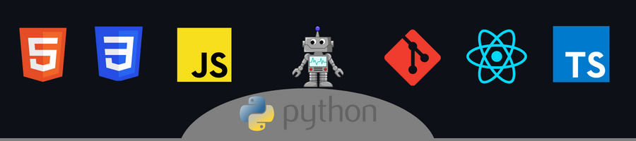

  

 

  As a future software developer, my passion for creating innovative and useful solutions drives me to keep learning and improving my skills. I want to make a difference in the world through technology and am excited to be part of an ever-evolving field.

  

## Currently

- I'm self-studying, focusing on creating custom projects and applications 🖤.
- Focused on and learning JavaScript in depth.
- Thinking and creating new ways to get things done. 
- I like to get out of my comfort zone and experiment.
 

## Goals

Now focus on learning Html Css.  
- Create projects that I already have in mind.  
- Expand my social circle. 
- Develop myself in a more professional way in software development.  
- Learn Js and implement them in my projects. 
