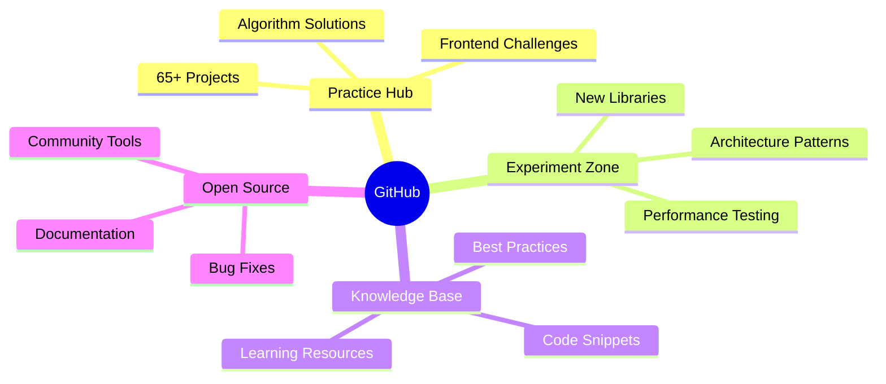

<h1 align="center">
  
</h1>

  
  

  
  

---

## 🛠️ Technical Expertise

  
| **Frontend** | **Backend** | **Databases** |
|--------------|-------------|---------------|
|    |   |  |
|   |  |  |
|  |  |  |

---

## 🌱 My GitHub Philosophy

  
### 🧠 Knowledge Laboratory
This space serves as my **digital workshop** where I:

## 📬 Let's Connect

  

  <em>"Transforming complex challenges into elegant digital solutions"</em>

  

